# **mediapipe-to-mixamo**

-   mediapipe to mixamo
    -   landmark name => bone name
    -   mediapipe pose => mixamo skeleton structure

## **5/3**

-   mediapipe to mixamo model
    -   Hips => AVG(left hip, right hip)
    -   Spine2 => AVG(Hips, Neck)
    -   Spine1 => AVG(Spine2, Hips)
    -   Spine3 => AVG(Spine2, Neck)
    -   Neck => AVG(left_shoulder, right_shoulder)
    -   Head => AVG(left_ear, right_ear)


mediapipe situp |mediapipe dance |mediapipe attack |mediapipe T pose
-|-|-|-
 | | |
**mixamo situp** | **mixamo dance** | **mixamo attack** | **mixamo T pose**
 | |  | 

## **5/5**

- binding pose test (only Hips)
    
```python
def get_hip_transform(glmList):
    b_leftleg = glm.vec3(glm.distance(glmList[Mixamo.Hips], glmList[Mixamo.LeftLeg]), 0, 0)

    norm_b_leftleg = glm.normalize(b_leftleg)
    norm_leftleg = glm.normalize(glmList[Mixamo.LeftLeg])
    transform = glm.rotate(glm.mat4(1.0), glm.acos(glm.dot(norm_b_leftleg, norm_leftleg)) ,glm.cross(b_leftleg, leftleg_v))
    return glm.inverse(transform)
```

before| after
-|-
|

## **5/6 ~ 5/15**

### **Visualize model's binding pose data**

```python
root_node1 = glmh.ModelNode()
root_node1.set_mixamo(result, mm_helper.get_mixamo_name_idx_map())
rv = []
rg = []
root_node1.get_vec_and_group_list(rv, rg, is_apply_tmp_transform= False)
```

|mixamo::amy|
|-|
|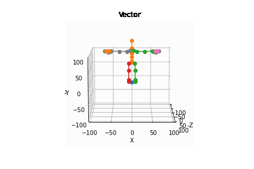|

### **Normalization: Binding pose**

- Make the distance of the binding pose vertices the same distance as the mediapipe result

```python
root_node1.normalize(glm_list, mm_helper.get_mixamo_name_idx_map())
```

```python
        if self.name == "Hips":
            self.position = mixamo_list[mixamo_idx_map[self.name]]
        else:
            n_position = glm.normalize(self.position)
            self.position = len*n_position
```
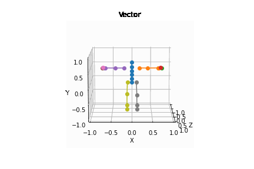

### **Calculate Transformation**

- Transformation of Hips
    ```python
    def calc_hip_transform_1(mixamo_list, hips_gizmo, left_up_leg_gizmo, spine_gizmo):
        transform = hips_gizmo.calc_rotation_matrix(
        left_up_leg_gizmo.get_origin(), mixamo_list[Mixamo.LeftUpLeg])

        hip_gizmo_r = hips_gizmo.rotate(transform)

        roll = hip_gizmo_r.calc_roll(
            transform*spine_gizmo.get_origin(), mixamo_list[Mixamo.Spine])
        return transform * roll
    ```

- Transformation of bones except hips

    ```python
    current_gizmo = self.get_gizmo(parent_transform)
    target_node = self.child[0]
    target_gizmo = target_node.get_gizmo(
    parent_transform*self.get_transform())
    target_vec = world_mixamo_adjust + \
                mixamo_list[mixamo_idx_map[target_node.name]]
    self.tmp_transform = current_gizmo.calc_rotation_matrix(
                target_gizmo.get_origin(), target_vec)
    ```

    -  calc_rotattion_matrix

        ```python
        def calc_rotation_matrix(self, world_start, world_end):
            local_point1 = glm.normalize(self.get_local_pos(world_start))
            local_point2 = glm.normalize(self.get_local_pos(world_end))
            return glm.rotate(glm.mat4(1.0),
                              glm.acos(glm.dot(local_point1, local_point2)),
                              glm.cross(local_point1, local_point2))
        ```
    - get_local_pose
        ```python
        def get_local_pos(self, world_pos):
            b = world_pos - self.r
            A = glm.mat3(self.x, self.y, self.z)
            x = glm.inverse(A)*b
            if math.isnan(x.x):
                x.x = 0.0
            if math.isnan(x.y):
                x.y = 0.0
            if math.isnan(x.z):
                x.z = 0.0
            return x
        ```


### **Sample1: Figure skaters' Jump**


|target|result|pixelate|
|-|-|-|
||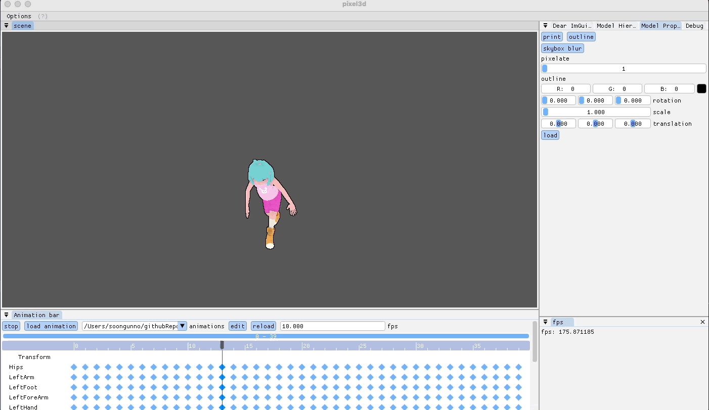|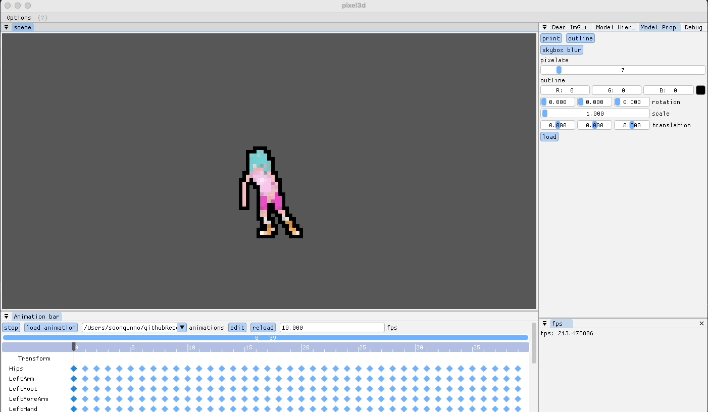

[image link](https://news.yahoo.com/gif-guide-figure-skaters-39-jumps-olympics-171900531.html)

### **Sample2: Mixamo dance animation**

- origin mixamo dance animation

    |origin animation|pixelate|
    |-|-|
    ||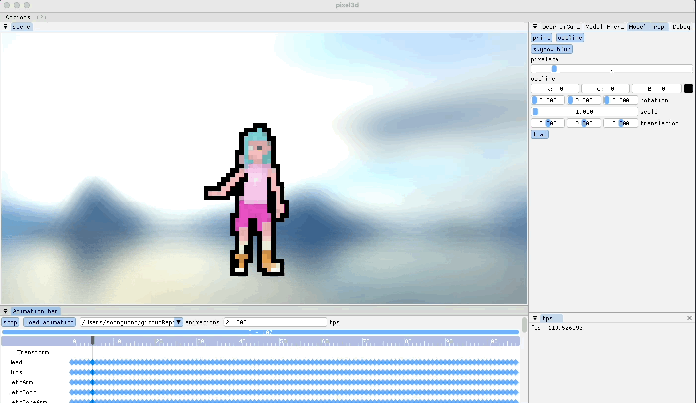|

- mixamo dance animation => mediapipe pose

    |target| mediapipe result|
    |-|-|
    || |

- medipipe pose => calc animation    
    |result1 | result 2| pixelate|
    |-|-|-|
    |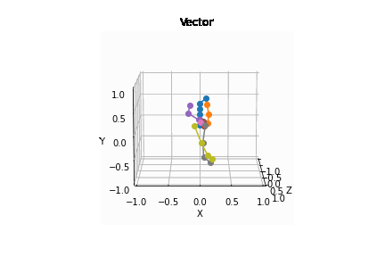|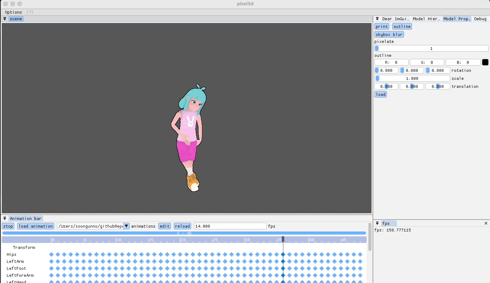|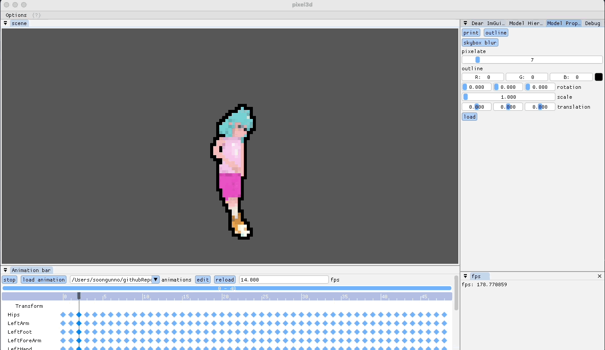|

### **Sample3: other characters**

- mixamo: Vampire a lusth
    |figure|dance|
    |-|-|
    |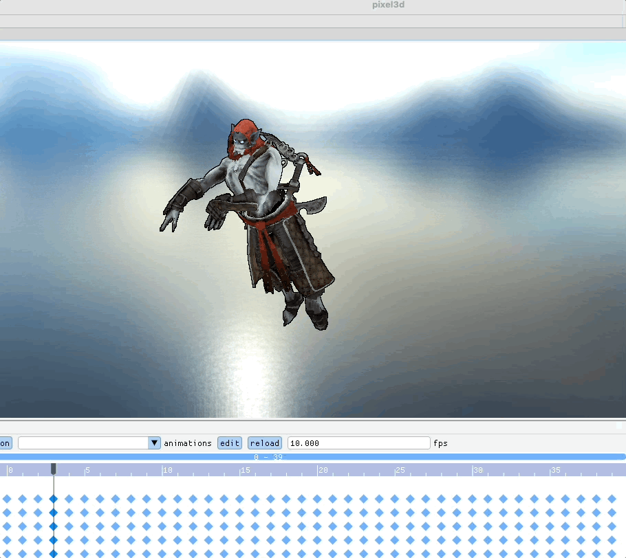||


- [cybog](https://github.com/JoeyDeVries/LearnOpenGL/tree/master/resources/objects/cyborg): auto rigging with mixamo
    |figure|dance|
    |-|-|
    |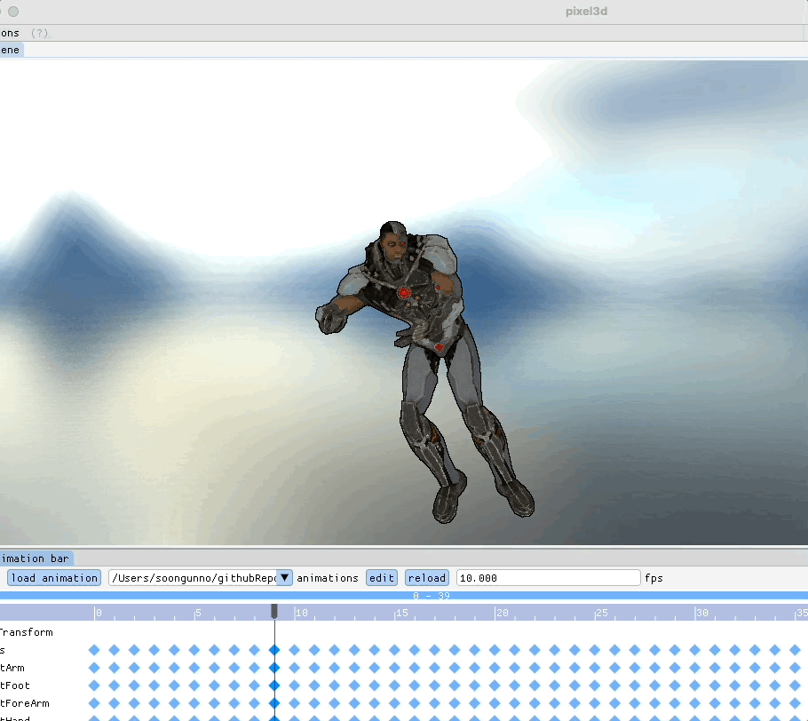|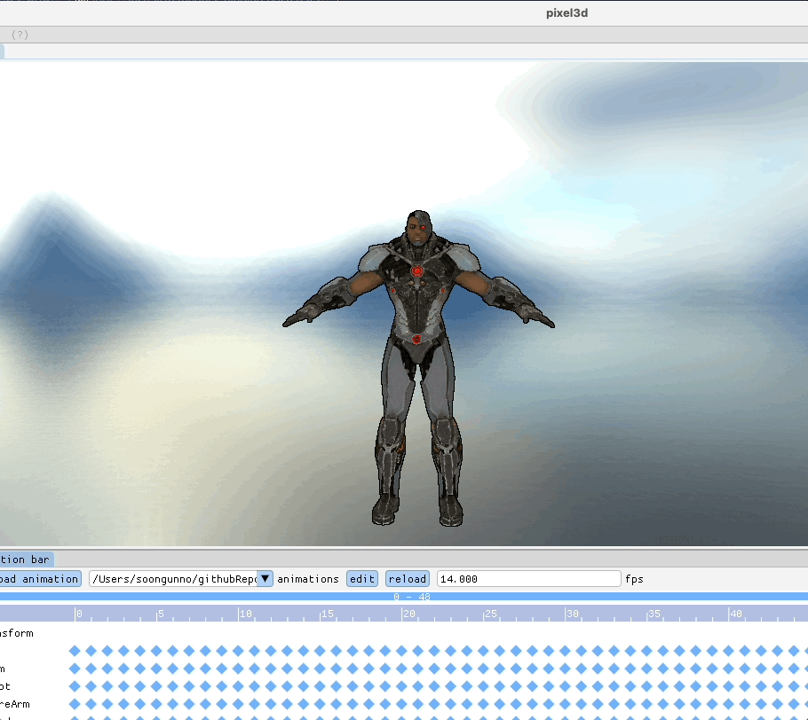|


## references

https://medium.com/@junyingw/how-to-use-mocap-data-to-animate-your-own-avatars-in-maya-889550138365

https://knowledge.autodesk.com/support/maya/learn-explore/caas/CloudHelp/cloudhelp/2018/ENU/Maya-CharacterAnimation/files/GUID-5DEFC6E5-033C-45D5-9A0E-224E7A35131B-htm.html