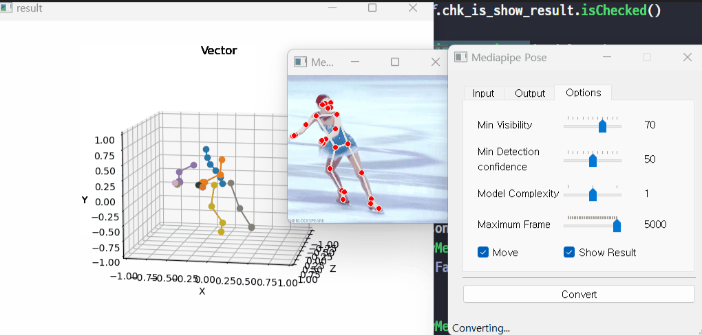

# **MP2MM v0.0.4**

## SEE

this project is deprecated

- see this project: [Anim](https://github.com/Nor-s/Anim)
    - [Anim/py_module](https://github.com/Nor-s/Anim/tree/master/py_module)

## mp2mm

-   result (on pixel3D)

## v0.0.4 => v0.0.4 update

- accuracy improvement
- Add YouTube url
- Fix error : mediapipe with as

## feature

-   mediapipe to mixamo animation data (can load to Pixel3D)

-   root motion on/off (move hip)

-   gif, mp4, avi, youtube ...

## todo

-   hand, foot: accuracy improvement

-   webcam => pixel3D

-   fbx export (maybe pixel3D feature)

## input

-   model binding pose data

    -   sample_input_data/zom_model.json: [pixel3d](https://github.com/Nor-s/Pixel3D)->debug->model to json

-   video file
    -   sample_input_data/figure.gif [link](https://news.yahoo.com/gif-guide-figure-skaters-39-jumps-olympics-171900531.html)

## references

https://medium.com/@junyingw/how-to-use-mocap-data-to-animate-your-own-avatars-in-maya-889550138365

https://knowledge.autodesk.com/support/maya/learn-explore/caas/CloudHelp/cloudhelp/2018/ENU/Maya-CharacterAnimation/files/GUID-5DEFC6E5-033C-45D5-9A0E-224E7A35131B-htm.html
