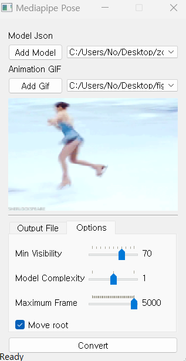

# **v0.0.2**

-   mediapipe to mixamo

## references

https://medium.com/@junyingw/how-to-use-mocap-data-to-animate-your-own-avatars-in-maya-889550138365

https://knowledge.autodesk.com/support/maya/learn-explore/caas/CloudHelp/cloudhelp/2018/ENU/Maya-CharacterAnimation/files/GUID-5DEFC6E5-033C-45D5-9A0E-224E7A35131B-htm.html
